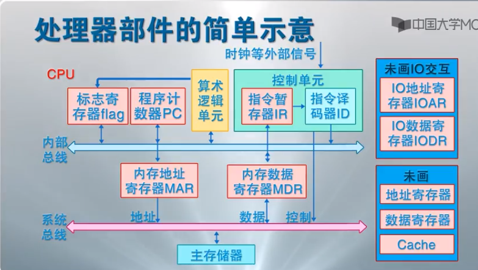

gcc 
编译系统：预处理器、编译器、汇编器、链接器

系统的硬件组成：
- 总线
通常总线设计为穿传递定长的字节块(word)，也就是字。字中的字节数是一个基本的系统参数，各个系统中不太相同。在32位系统中，机器的字长是4个字节，而在64位系统里面，机器的字长是8个字节。

## CPU
- 程序计数器PC
- 标志寄存器
- 算数/逻辑单元ALU
- 控制单元
    - 指令暂存器IR
    - 指令译码器ID

## 并发和并行
### 并发
一个同时具有多个活动的系统
### 并行
用并发来使一个系统运行的更快

## 进程和线程
